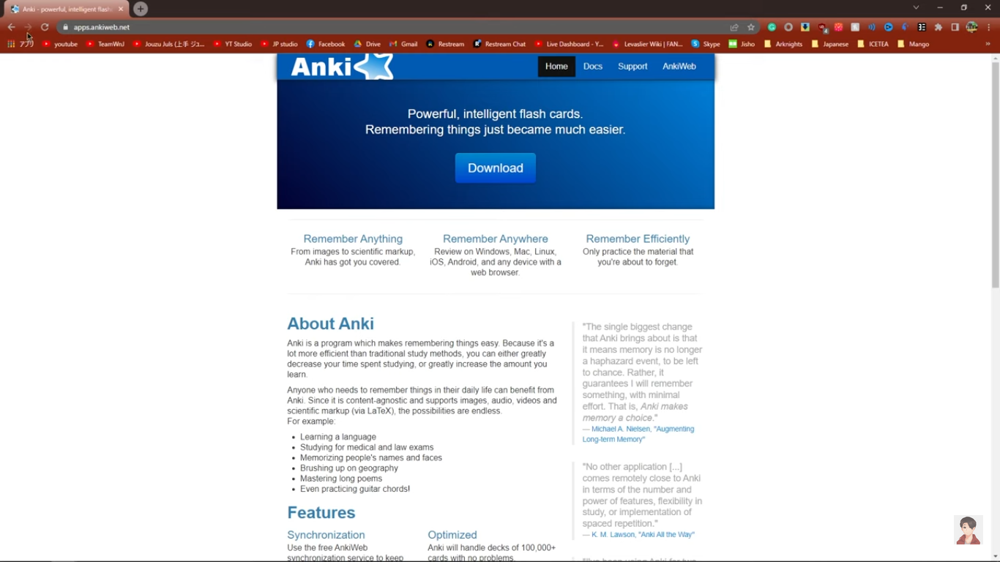
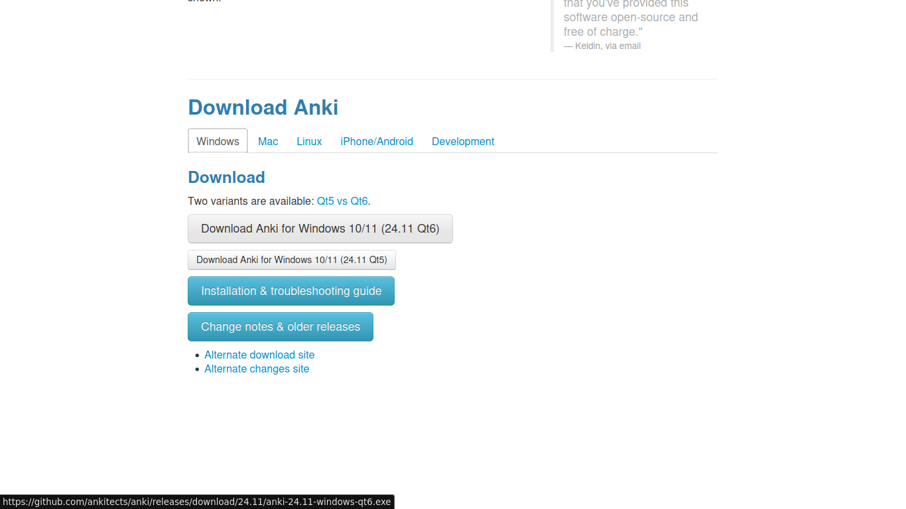
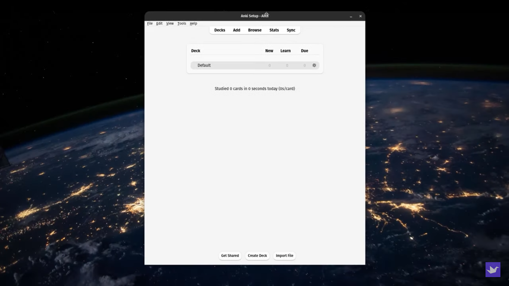

# Tất tần tật về cách sử dụng Anki cơ bản

Anki là phần mềm cho phép bạn học từ vựng thông qua các Flash Cards. Các Flash Cards này có thể có sẵn hoặc do bạn tự tạo. Mỗi một bộ Flash cards gọi là "Deck", mình tạm dịch là Bộ Từ Vựng. Các bạn nên tự tạo bộ từ vựng riêng cho mình vì mỗi người có nhu cầu học khác nhau cũng như trình độ khác nhau. Mình đã thử vài bộ từ có sẵn và đều không cảm thấy thoải mái vì có bộ thì quá dễ, có bộ lại quá khó.

## Sử dụng Anki cơ bản

### 1. Cách tải xuống, cài đặt và học bộ từ vựng

Bạn có thể tải xuống Anki tại [trang chủ của Anki](https://apps.ankiweb.net/).

Khi bấm "Download" thì nó sẽ tự chuyển xuống mục Tải xuống ở cuối trang

Bạn có thể chọn một trong hai cái đều được.

Sau khi tải xuống hoàn tất, bạn nhấp đúp chuột vào tệp cài đặt của phần mềm, bấm Next liên tục là xong (Nếu bạn sử dụng Windows).

Sau khi cài đặt xong bạn sẽ thấy biểu tượng Anki hiện trên Desktop. Khi mở ứng dụng lần đầu tiên bạn sẽ được yêu cầu chọn ngôn ngữ, bạn có thể để mặc định là **English** hoặc nếu muốn để Tiếng Việt thì chọn **Vietnamese** nha.

Để tự tạo bộ từ vựng cho mình, bạn chọn **Create Deck**. Nếu muốn sử dụng các bộ từ vựng có sẵn, bạn chọn **Get Shared** (Nếu bạn chọn **Get Shared** thì Anki sẽ tự động mở trình duyệt và chuyển đến kho các bộ thẻ đã được làm sẵn bởi các người dùng khác).

### 2. Tạo bộ thẻ, tạo thẻ và Import bộ thẻ khác.

#### Tạo bộ thẻ

Bạn chỉ cần chọn **Create Deck** và nhập tên bộ thẻ bạn muốn tạo, bấm Ok là xong

#### Tạo thẻ

Khi bấm **Add** thì sẽ hiện lên một cửa sổ:

Ở góc trên bên trái màn hình sẽ hiện chữ **Type**, đó là kiểu thẻ của thẻ bạn muốn tạo và góc trên bên phải màn hình là **Deck**, là bộ thẻ mà bạn sẽ lưu thẻ này vào.

Ở đây Type sẽ được đặt là **Basic** và sẽ chỉ hiện 2 trường (Field) là Front và Back, nội dung nhập vào Front sẽ hiện ở mặt trước của thẻ và Back sẽ hiện ở mặt sau của thẻ.

Bấm vào **Add** để thêm thẻ mới

Điền thông tin vào thẻ. 1 thẻ ghi nhớ thường bao gồm 2 mặt:

- Front: Mặt trước của thẻ: đây là ghi nội dung truyền tải của nội cần học/ghi nhớ.
- Back: Mặt ghi câu trả lời của mặt trước.

Mỗi một thẻ từ vựng sẽ có hai mặt là mặt trước (Front) và mặt sau (Back)

Trong Anki sẽ có các Card Type (Hay "kiểu thẻ"), mỗi một kiểu thẻ sẽ bao gồm những Field khác nhau để bạn điền. Phần tiếp theo chúng ta sẽ nói thêm về các kiểu thẻ khác nhau. Ở phần này, chúng ta sẽ chỉ sử dụng kiểu thẻ Basic.

Sau khi nhập xong, các bạn có thể thêm tag cho từng thẻ nếu muốn. VD: khi xong thẻ và bạn muốn đánh dấu đây là thẻ về danh từ, có thể ghi **Danh từ**, **Từ chỉ cảm xúc** vào phần Tags để sau này có thể chọn ôn theo từng tag

Sau đó bấm Add để lưu thẻ vào trong Deck.

### Kiểu thẻ (Card Type) trong Anki
#### Phân biệt các kiểu thẻ
Phần này mình trích từ [Anki Manual](https://docs.ankiweb.net/getting-started.html#note-types) - Bạn nên đọc để tìm hiểu thêm. Ở mỗi kiểu thẻ mình sẽ để đường dẫn video trên Youtube (bằng Tiếng Việt) và cách tạo thẻ ở tên các mẫu thẻ.

- [Basic](https://www.youtube.com/watch?v=PLnJ1l6f7mQ): Có các trường "Mặt trước" và "Mặt sau" và sẽ tạo một thẻ. Văn bản bạn nhập vào "Mặt trước" sẽ xuất hiện ở mặt trước của thẻ và văn bản bạn nhập vào "Mặt sau" sẽ xuất hiện ở mặt sau của thẻ.
- Basic (and reversed card): Giống như "Basic", nhưng tạo ra hai thẻ cho văn bản bạn nhập: **mặt trước → mặt sau** và **mặt sau → mặt trước**.
- Basic (optional reversed card): Giống như "Basic", nhưng có trường thứ ba gọi là "Add Reverse". Nếu bạn nhập bất kỳ văn bản nào vào trường đó, một thẻ đảo ngược (mặt sau → mặt trước) cũng sẽ được tạo.
- [Basic (type in the answer)](https://www.youtube.com/watch?v=8NJGekdR9BI) - Về cơ bản, đây là kiểu thẻ "Basic", có thêm một hộp văn bản ở mặt trước, nơi bạn có thể nhập câu trả lời của mình. Khi bạn "Show Answer", Anki sẽ hiển thị cho bạn bất kỳ sự khác biệt nào giữa nội dung bạn nhập và câu trả lời thực tế (Thẻ trả lời câu hỏi).
- [Cloze](https://www.youtube.com/watch?v=-aSlCY6VeTw&pp=ygURdGjhursgY2xvemUgYW5raSA%3D): Một loại ghi chú cho phép bạn chọn văn bản và biến nó thành một bản xóa cloze (ví dụ: "Con người đã hạ cánh trên mặt trăng vào năm […​]" → "Con người đã hạ cánh trên mặt trăng vào năm 1969"). Để biết chi tiết, hãy xem phần xóa cloze. 
- Image Occlusion (Hay "Hình ảnh che khuất"): Giống như cloze, nhưng sử dụng hình ảnh thay vì văn bản, đặc biệt hữu ích khi nghiên cứu tài liệu dựa nhiều vào hình ảnh, chẳng hạn như giải phẫu và địa lý.

Bạn cũng có thể tự tạo kiểu thẻ riêng cho mình. Đọc thêm ở Anki Manual để tìm hiểu về cách tự tạo Card Type.

#### Hướng dẫn lựa chọn

| **Danh mục** | **Kiểu thẻ gợi ý** | **Lý do** |
| --- | --- | --- |
| Về cơ bản | Basic + Reversed | Avoid tip-of-the-tongue issues. |
| Screenshots từ video (YouTube, etc) | Basic | It's hard to format screenshots to fit front-and-back or cloze formats. |
| Code Block (Snippet) | Basic, Sử dụng Anki Code Plugin | Most code snippets are hard to format. |
| Code Block (StackOverflow Answer) | Basic, Cloze | Most code snippets are hard to format to fit basic-and-reversed. I frequently will just take a snapshot of the answer and paste unformatted. |
| Định nghĩa | Basic | Basic-and-reversed can have multiple answers. Easier to make a basic card. Definitions in cloze can let the answer slip too easily. |
| Các đoạn văn bản trên Wikipedia | Cloze | Các đoạn văn bản trên Wikipedia có ngữ cảnh, giúp bạn tập trung vào ý cơ bản cần nhớ |
| Ảnh có nhãn (Cơ thể con người, Anatomy, Bản đồ, etc) | Image Occlusion Plugin | Sử dụng visual memory. |
| Danh sách (List) | Cloze | Học danh sách thông qua thẻ Basic khá khó nhớ. Sử dụng Cloze và chia danh sách ra thành nhiều thẻ |

### Sử dụng các bộ thẻ được làm sẵn (premade decks)

Bộ thẻ được tạo sẵn giúp giảm thời gian tạo thẻ để học. Có nhiều bộ thẻ được tạo sẵn cho các chủ đề khác nhau. Bạn có thể tải trên trang [Shared Decks của Anki](https://ankiweb.net/shared/decks/).

Tìm trên tranh tìm kiếm hoặc chọn các chủ đề ở trang Shared Decks, sau đó tìm trong danh sách bộ thẻ được chia sẻ cho đến khi bạn tìm thấy tiêu đề bộ thẻ mà bạn muốn sử dụng. Bạn cũng có thể bấm vào một bộ thẻ bất kì và xem một số thẻ ví dụ. 

Sau khi đã chọn được một bộ thẻ, kéo xuống để tìm nút tải xuống màu xanh và bấm vào đó để tải bộ thẻ về. Sau khi tải xong, mở Anki và bấm vào "Import File" ở dưới màn hình chính để thêm bộ thẻ vào kho thẻ của bạn.

### Các phiên học

Sau khi tạo bộ thẻ và thêm các thẻ từ vựng (Hoặc bạn đã **Import** bộ thẻ bạn đã tải xuống trên mạng về), chúng ta có thể bắt đầu ôn tập. Bạn bấm vào bộ thẻ bạn cần học

Bấm **Study Now** để bắt đầu.

Khi card hiển thị, bạn phải tự "trả bài" cho mình về nghĩa của từ, loại từ, thường dùng trong ngữ cảnh nào, các từ liên quan hoặc word families của nó. Sau khi tự "trả bài" xong, bạn click vào "Show Answer" để xem nghĩa của từ.

Sau khi đọc "Answer", bạn đánh giá độ khó của từ đối với bản thân.

!!! info "Cách chấm điểm đơn giản"
    Bấm "Again" nếu sai hoặc không biết, nếu đúng thì bấm "Good"
    (Nếu bạn mới bắt đầu sử dụng Anki thì có thể học theo kiểu này)

Sau khi chọn mức độ khó của từ rồi thì các từ kế tiếp cứ tiếp tục hiện ra và bạn chỉ việc làm theo trình tự như trên cho đến khi hết câu hỏi và đã review lại luôn những từ khó.

Sau khi ôn tập lại các từ cũ và học xong khối lượng từ mới hàng ngày là hoàn thành một phiên học Anki.

### Thiết lập Anki nâng cao

<iframe width="560" height="315" src="https://www.youtube.com/embed/uLfczzq9z_8?si=cSmr1mhbTosqOdvz" title="YouTube video player" frameborder="0" allow="accelerometer; autoplay; clipboard-write; encrypted-media; gyroscope; picture-in-picture; web-share" referrerpolicy="strict-origin-when-cross-origin" allowfullscreen></iframe>

### Một số mẹo nhanh

Bây giờ bạn đã biết Anki hoạt động như thế nào, tại sao bạn nên sử dụng nó và cách bạn có thể sử dụng nó. Tuy nhiên, có một số mẹo và thủ thuật đặc biệt mà tôi đã học được trong những năm qua khi học với ứng dụng này sẽ giúp ích cho bạn. 

#### Cách tạo thẻ ghi nhớ từ ghi chú giấy nhanh

Sử dụng ứng dụng OCR hoặc Google Lens rồi ném lên máy tính (Với nhà Apple thì dùng AirDrop hoặc với Android và các hệ thống khác thì có thể dùng KDEConnect hoặc gửi qua Messenger hoặc Zalo).

#### Học thuộc phím tắt
Bạn cũng có thể học thuộc phím tắt trên Anki để giúp cho việc sử dụng được thuận tiện hơn. Một số phím mà cá nhân mình thường dùng:

- 1, 2, 3, 4: Chấm điểm
- `d` - Về trang chủ của Anki
- `e` - Sửa lại nội dung thẻ khi đang ôn tập
- `b` - Truy cập mục `Browse` của Anki
- `y` - Sync
- `t` - Xem thống kê của Anki
- `Ctrl-Shift-A` - Truy cập vào mục Add-ons

Và còn nhiều nữa

### Sử dụng Anki hàng ngày
Khi bạn đã biết được Anki thực sự hiệu quả, việc còn lại chỉ là sử dụng Anki hàng ngày

Với những người mới bắt đầu tập sử dụng Anki, việc có một thói quen học tập và sự khó khăn trong việc sử dụng Anki là kẻ thù hàng đầu. Việc duy trì thói quen hàng ngày là một điều vô cùng quan trọng trong việc sử dụng Anki.

Đây là một số mẹo có thể giúp bạn xây dựng thói quen sử dụng Anki hàng ngày:

#### 1. Sử dụng Review Heatmap Addon

Bấm để tải [Review Heatmap Addon](https://ankiweb.net/shared/info/1771074083)

(Trong màn hình chính của Anki chọn Tools > Add-ons > Get Add-ons và sao chép mã vào trong ô đó (của Review Heatmap là 1771074083)) 

Addon này giúp bạn quan sát được tiến trình học tập của bạn và có thể sẽ tạo động lực học tập cho bạn.

#### 2. Duy trì sự tập trung trong khi ôn tập.

Việc ôn tập Anki sẽ rất chán, vậy nên hãy chuẩn bị và tập trung vào việc hoàn thành Anki hàng ngày.

#### 3. Khởi đầu nhỏ hàng ngày và xây dựng thành một thói quen.

Về cơ bản là cuốn Atomic Habit.

## Tìm hiểu thêm

Bạn có thể học khóa [Anki cơ bản](https://hocanki.com/ii-anki-co-ban/020-anki-co-ban/) (Không biết có phải được làm bởi AnkiVN không, nhưng có khá nhiều bài hướng dẫn miễn phí nên mọi người có thể học)

### Cài đặt Anki cho các nền tảng khác (MacOS, Linux, Android, iOS)

- [Hướng dẫn học tiếng Anh qua Flashcard trên AnkiDroid chi tiết](https://www.thegioididong.com/game-app/huong-dan-hoc-tieng-anh-qua-flashcard-tren-ankidroid-chi-tiet-1378805)

### Video

- [Một video hướng dẫn nhanh cách sử dụng, học, thêm thẻ và tối ưu quá trình học trong Anki](https://www.youtube.com/watch?v=Om_1NECh8sQ) - Video nhà làm
- [Video hướng dẫn của Đat Nguyễn trên Youtube](https://youtu.be/M9-qwsHyBrc)

### Bài viết

- [Cách mình học 500 từ mỗi ngày và tăng từ 7+ lên 9+ điểm thi tiếng anh THPTQG trong khoảng 2 tháng](https://spiderum.com/bai-dang/Cach-minh-hoc-500-tu-moi-ngay-va-tang-tu-7-len-9-diem-thi-tieng-anh-THPTQG-trong-khoang-2-thang-k8Pd390eNrS3)
- [Cảm nhận sử dụng của một người dùng trên Spiderum](https://spiderum.com/bai-dang/Tron-1-nam-su-dung-Anki-de-nho-moi-thu-va-mot-so-ghi-chu-8pz)

